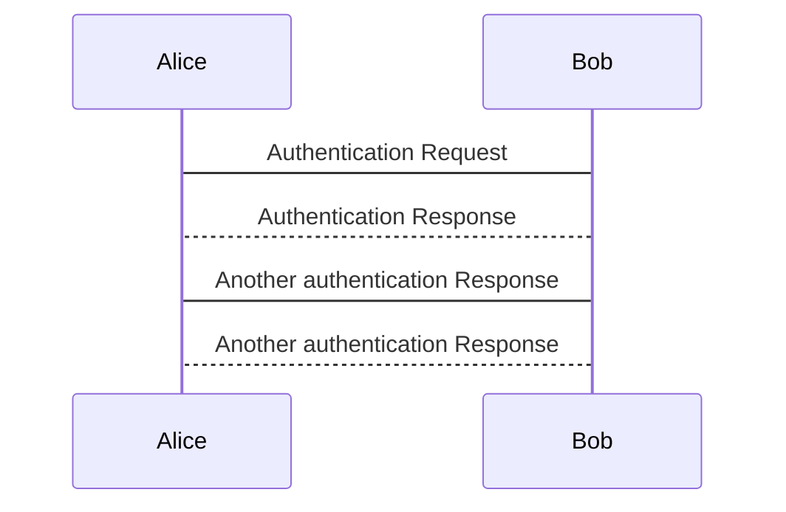

### Использование pluntUml в markdown


```mermaid
sequenceDiagram
Alice -> Bob: Authentication Request
Bob --> Alice: Authentication Response
Alice -> Bob:Another authentication Response
Bob --> Alice: Another authentication Response
```

<div hidden>
```
@startuml firstDiagram

Alice -> Bob: Hello
Bob -> Alice: Hi!
		
@enduml
```
</div>


